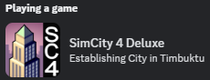

# sc4-discord-rich-presence

A DLL plugin for SimCity 4 that implements Discord rich presence support.

In the city view, the plugin displays the city name, various city statistics and the elapsed time.

In the region view, the plugin displays the region name and various region statistics.

When establishing a city, the plugin displays Establishing City in region name.

## System Requirements

* Windows 10 or later

The plugin may work on Windows 7 or later with the [Microsoft Visual C++ 2022 x86 Redistribute](https://aka.ms/vs/17/release/vc_redist.x86.exe) installed, but I do not have the ability to test that.

## Installation

1. Close SimCity 4.
2. Copy the `Apps` folder into your SimCity 4 installation directory.
3. Copy the `Plugins` folder into the SimCity 4 installation directory or Documents/SimCity 4 directory.
4. Start SimCity 4.

## Troubleshooting

The plugin should write a `SC4DiscordRichPresence.log` file in the same folder as the plugin.    
The log contains status information for the most recent run of the plugin.

If the log file was not created, ensure that `discord_game_sdk.dll` is in the `Apps` folder next to `SimCity 4.exe`
and that the Microsoft Visual C++ 2022 x86 Redistribute has been installed.

# License

This project is licensed under the terms of the MIT License.    
See [LICENSE.txt](LICENSE.txt) for more information.

## 3rd party code

[gzcom-dll](https://github.com/nsgomez/gzcom-dll/tree/master) Located in the vendor folder, MIT License.    
[EABase](https://github.com/electronicarts/EABase) Located in the vendor folder, BSD 3-Clause License.    
[EASTL](https://github.com/electronicarts/EASTL) Located in the vendor folder, BSD 3-Clause License.    
[Windows Implementation Library](https://github.com/microsoft/wil) - MIT License.    
[Discord Game SDK](https://discord.com/developers/docs/game-sdk/sdk-starter-guide) - [Discord Developer Terms of Service](https://discord.com/developers/docs/legal).    

# Source Code

## Prerequisites

* Visual Studio 2022
* [VCPkg](https://github.com/microsoft/vcpkg) with the Visual Studio integration
* A `SC4_DISCORD_DLL_APP_ID` environment variable that is set to your Discord application/client id.

## Building the plugin

* Open the solution in the `src` folder
* Update the post build events to copy the build output to you SimCity 4 application plugins folder.
* Build the solution

## Debugging the plugin

Visual Studio can be configured to launch SimCity 4 on the Debugging page of the project properties.
I configured the debugger to launch the game in full screen with the following command line:    
`-intro:off -CPUcount:1 -w -CustomResolution:enabled -r1920x1080x32`

You may need to adjust the window resolution for your primary screen.
